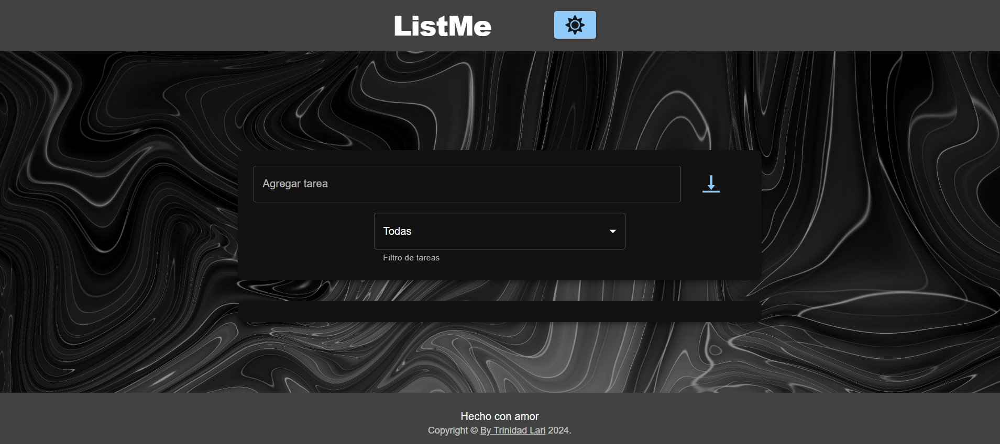
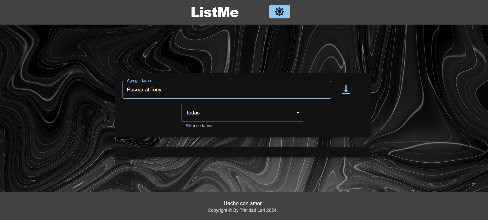
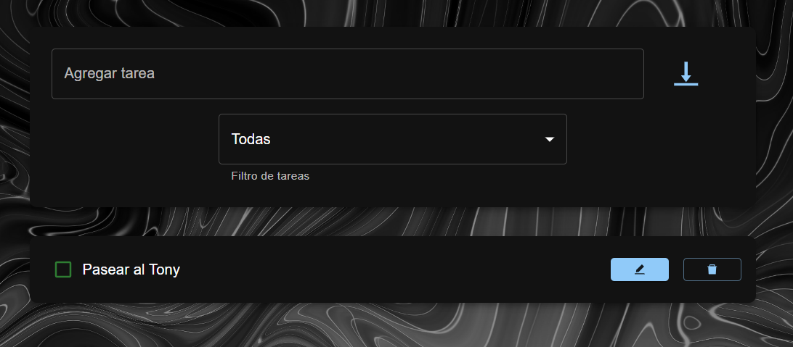
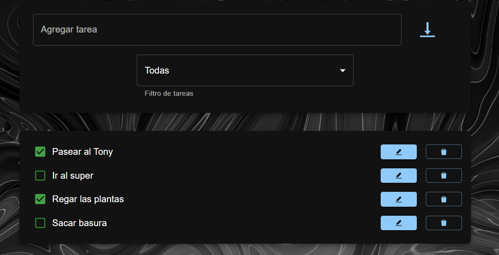
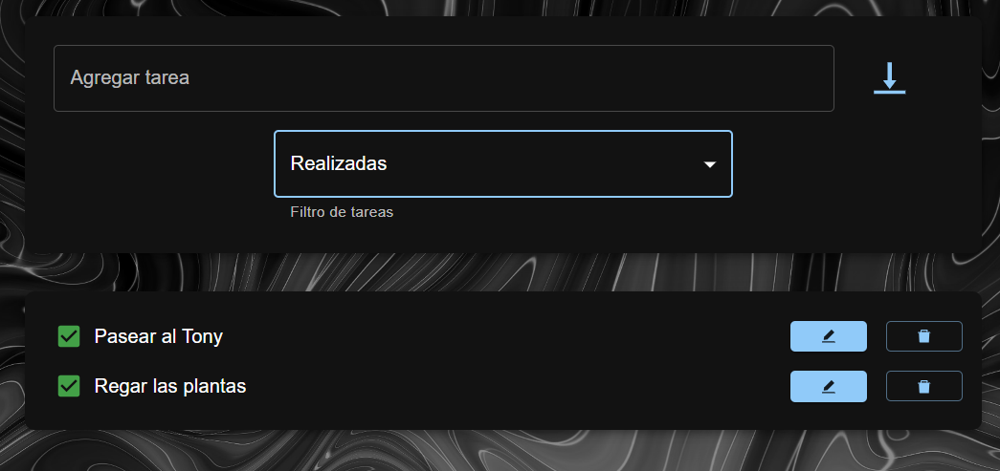
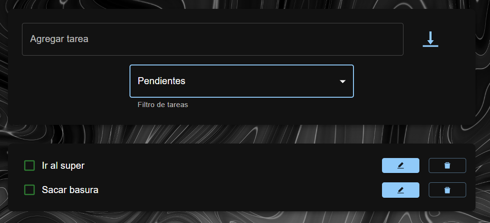
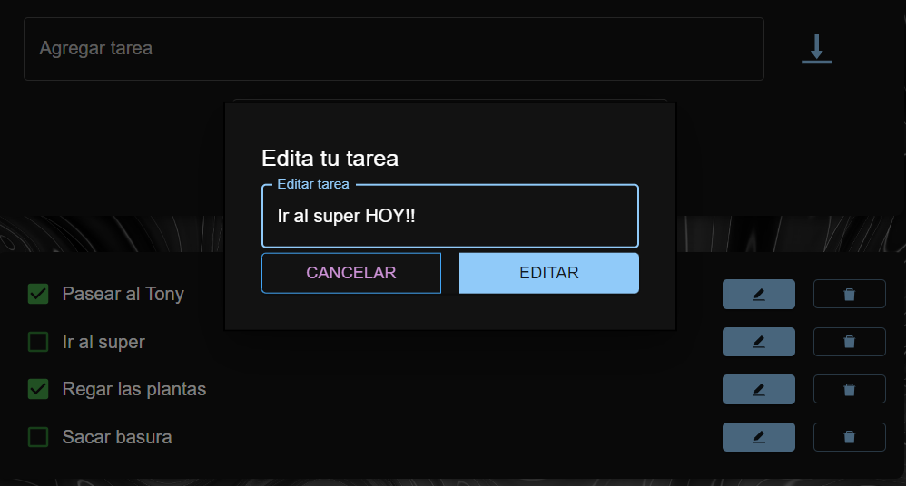
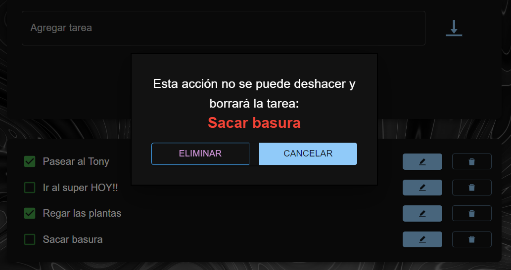
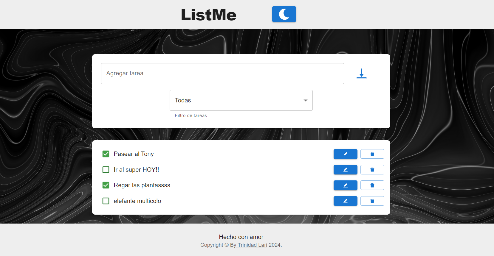

# ListMe

ListMe es una app sencilla, diseñada para realizar una lista de tareas e ir checkando las realizadas!

## Escribir tarea

La caracteriza la fácilidad de su uso. Es realmente intuitiva a la hora de usarla. Para ingresar su primer tarea complete el campo donde se indica "agregar tarea"

Una vez escrita puede añadirla a la checklist apretando "Enter" o haciéndo click soble la flecha a su derecha

## Tareas Realizadas

Al ir completando las tareas, podemos usar el checkbox para tildarlas como realizadas!!

## Los filtros y el poder del orden 🤭

Si queres sumarle facilidad a este asunto complejo de tener tareas diarias, podes filtrarlas por realizadas...

O por tareas pendientes 😉.

## Editar tarea

Haciendo click en el ícono del lápiz tendras la opción de modificar una tarea si así lo deseas.

## Eliminar tarea

Si una tarea te resultó tan tediosa de hacer que preferis olvidarla, 🤭 haciendo click en el cesto de basura de la derecha podes eliminarla y dejarla ir para siempre!!!

## Modo claro - Modo oscuro

Tambien tenés la opción de usar esta app en modo claro... Podes acceder haciendo click en el boton del sol y este será el serultado:

### ESPERO QUE LO DISFRUTES Y QUE SEA ÚTIL PARA ORGANIZAR TU DÍA A DÍA

Esta hecho con mucho amor 🧡

Esta app es propiedad de Trinidad Lari y está bajo su nombre. Todos los derechos reservados.
[ListME][trinidadlari.github.io/ListMe/]